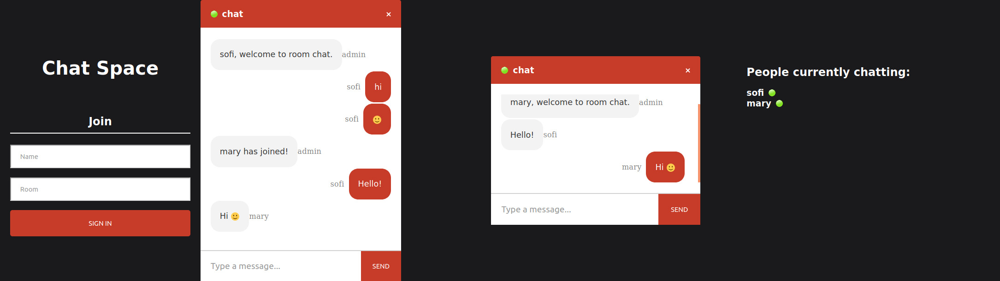

# Chat Space App

This repository contains a realtime chat application built with React on the front-end and NodeJS + Socket.io web socket library on the back-end.

Below , you'll find a screenshot of the app rendering both in mobile and desktop.

## Technologies

React

## Packages

Front End:

query-string 
react-emoji 
react-router 
react-scroll-to-bottom 
socket.io-client

Back End:

cors 
express 
nodemon 
socket.io

## Setup

Run npm i && npm start for both client and server side to start the app.

## Author

Sofia
